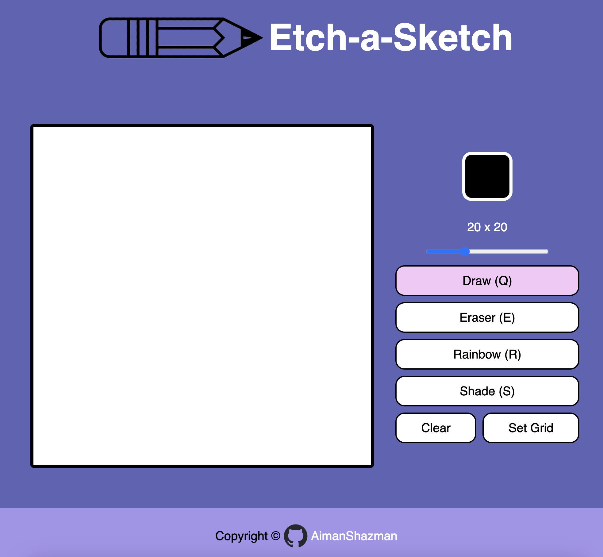

# Etch-a-Sketch

Odin-Project Foundations : (Etch-a-Sketch)

collaborated with: <a href="https://github.com/NadhiraSyazwani">Nadhira Syazwani</a>

<a href="https://aimanshazman.github.io/Etch-a-Sketch/">Try it out here!</a>

## Usage
<ul>
    <li>Set Color: Choose the color</li>
    <li>Grid ScrollBar: Scroll to choose the size of grid</li>
    <li>Draw mode: Color a single grid. Can be toggled to switch between Draw mode and Hover mode.</li>
    <li>Hover mode: Color the grid on mouse hover.</li>
    <li>Eraser mode: Erase colored grid</li>
    <li>Rainbow mode: Generate a random color</li>
    <li>Shade mode: Darken the grid's color. Turns a grid black on the 10th interactions.</li>
    <li>Clear: Clear the grid.</li>
    <li>Set Grid: Clear the grid and create a new grid size based on Grid ScrollBar.</li>
</ul>

## Shortcuts!
<ul>
    <li>Draw mode: Press the Q key</li>
    <li>Eraser mode: Press the E key</li>
    <li>Rainbow mode: Press the R key</li>
    <li>Shade mode: Press the S key</li>
</ul>

## Image Credit
<ul>
    <li>Pencil by Brian Goff: https://www.vecteezy.com/vector-art/554192-yellow-pencil-vector</li>
</ul>

